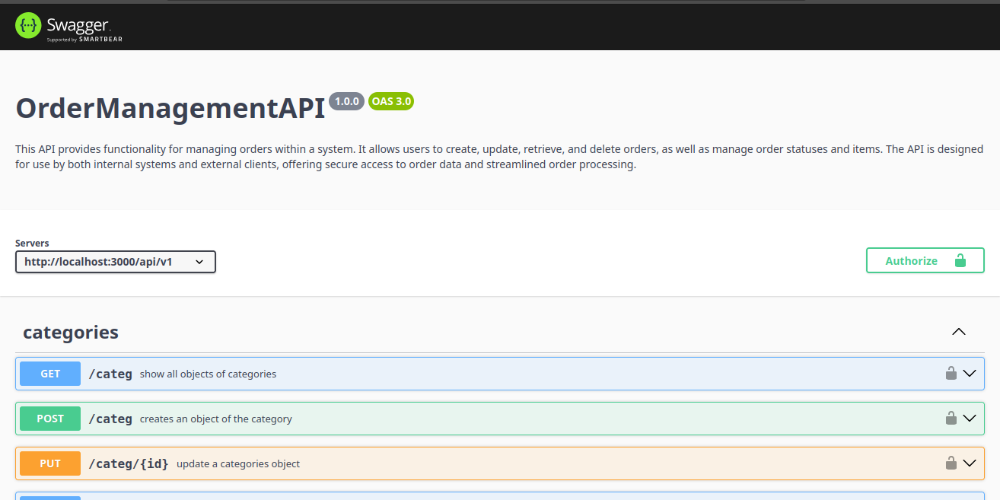
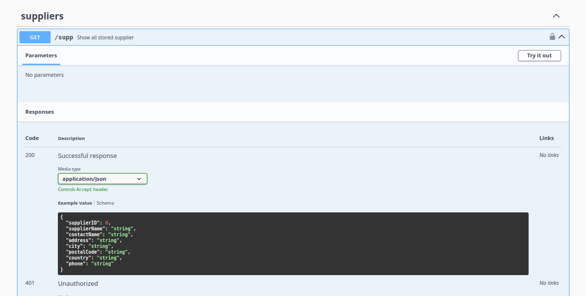
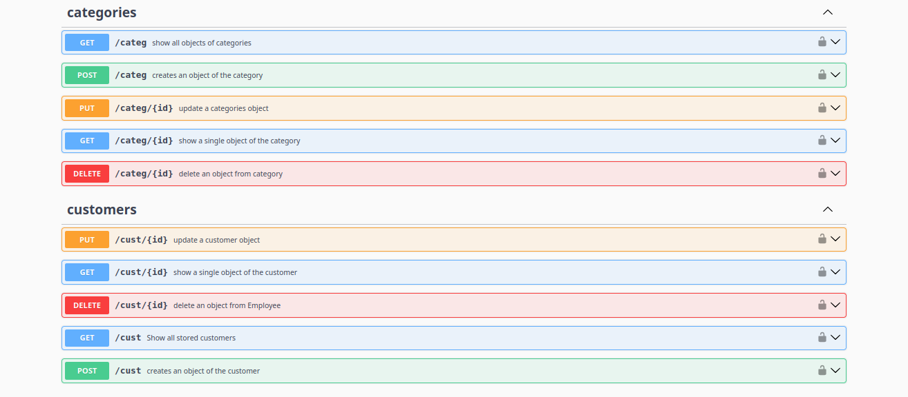

# OrderManagementAPI
#
Aim:

    is used to manage data related to a sales or inventory system.
    It allows you to create, read, update, and delete (CRUD) operations
    about categories, customers, employees, order details, orders, products, carriers, and suppliers.

Use:

This API can be used in a variety of applications,
such as:

    E-commerce websites to manage product catalogs, customer orders, and inventory.
    Point-of-sale systems to track sales transactions and customer information.
    Inventory management systems to manage product stock levels and supplier relationships.
    Customer relationship management (CRM) systems to store customer data and track interactions.

## Tech Stack


##
Common Authentication Methods in cURL

    curl --request POST \
    --url https://dev-6kheafszlnh3mean.us.auth0.com/oauth/token \
    --header 'content-type: application/json' \
    --data '{"client_id":"n7NT67hwzegTK45FY3215FHISKwGHYz7","client_secret":"sZlilc-bQFuR0TMOEydUZ-Ge4ffYIU5xqbQNYcXvLjDl8qH2f7TGMIQgbOqnHzCj","audience":"https://api-northwin","grant_type":"client_credentials"}'


## Environment Variables

To run this project, you will need to add the following environment variables to your .env file


## Database Configuration

`MONGO_URI=mongodb://localhost:porto/northwin` 

## the applications authorized by issuing the following API call

`OAUTH_AUDIENCE=http://localhost:3000/api-customer`

`OAUTH_URL=https://dev-6kheafszlnh3mean.us.auth0.com/oauth/token`

## Server Configuration
`PORT=3000` Port on which the application is running


## Installation

Install my-project with npm

```bash
  npm install 
```
build an image with docker

```bash
  docker compose build
```
run:

```bash
  docker compose up
```


## Screenshots

routes documented in swagger








